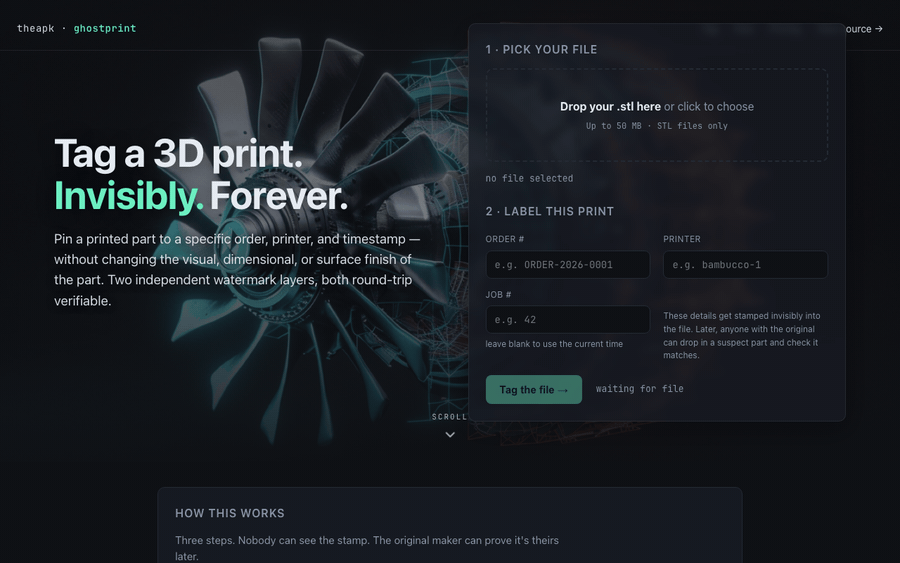

# ghostprint

> Two-layer invisible watermark for 3D-printed parts.
> Forensics, not DRM. Free for noncommercial use + hosted web version.

[](LICENSE)
[]()
[](https://pypi.org/project/theapk-ghostprint/)

---

## What it does

Once a 3D-print customer has the STL, you can't stop them from copying it forever. What you can do is prove the part they printed came from your STL.

ghostprint adds two independent invisible watermarks to your STL:

- **Layer 1 — G-code watermark.** A 12-byte payload (printer + job + timestamp) encoded into sub-resolution Z-babysteps at the start of the print, duplicated in a `;` comment block. Survives any slicer that doesn't strip comments.
- **Layer 2 — Geometric steganography.** Per-vertex perturbation of ±0.005–0.020 mm driven by a BLAKE2b hash of the order ID. Smaller than a typical 0.04 mm nozzle X/Y resolution. Holds up to translation, rotation, scaling, and minor mesh repair.

Later, if a suspect part shows up, drop the original STL back in and ghostprint tells you whether it matches.

## Demo



*Above: an STL → tagged STL → verify cycle. Both watermarks extracted, both match the original order.*

## Install

```bash
pip install theapk-ghostprint
```

## Use

```bash
# Tag an STL with order metadata
ghostprint tag master.stl \
  --order-id ORDER-2026-0001 \
  --printer bambucco-1 \
  --job-seq 42 \
  --out tagged.stl

# → writes tagged.stl + manifest.json (signed)

# Later, verify a suspect part
ghostprint verify master.stl tagged.stl
# → ✅ L1 match: job_seq=42 ts_unix=1751...
# → ✅ L2 match: order_id_hash=a3f... printer_id=bambucco-1
```

## Drag-drop web version

If you don't want to install Python, there's a hosted version:

**👉 https://ghostprint.theapk.com**

Three steps. No account required for the free tier. The web version uses the same CLI underneath — `tag-print.py` is the source of truth.

## Pricing (hosted version)

| Tier | Price | What you get |
|---|---|---|
| CLI | **Free** | Python, no upload, no tracking. Free for noncommercial use; commercial use requires a license. |
| Maker | $9/mo | Drag-drop web tool, hold master STLs in your account |
| Studio | $49/mo | Unlimited tags, multi-printer fleet dashboard, API access |

## Architecture

```
                   ┌──────────────────┐
   master.stl ───▶ │                  │
                   │   tag-print.py   │ ───▶ tagged.stl + manifest.json
   --order-id  ──▶ │                  │           (signed, ~order metadata)
   --printer   ──▶ │                  │
   --job-seq   ──▶ │                  │
                   └──────────────────┘

   master.stl ──┐
                ├──▶ verify ───▶ ✅ / ❌ + extracted metadata
   suspect.stl ─┘
```

Both layers are written by `tag-print.py`. No GPU, no network, runs in <2 seconds for a 50MB STL. Implementation is ~500 lines of stdlib + numpy-stl + trimesh.

## What it's not

- **Not DRM.** Can't stop someone from copying. Can't stop someone from stripping the watermark.
- **Not encryption.** Anyone with the original STL can extract the watermark. That's the point.
- **Not visible.** Both layers are below typical print resolution. Won't show up on the part.

It's forensics. Think "document fingerprinting", not "encryption".

## Limitations

- L1 requires the G-code, not the STL. If the slicer strips `;` comments (very rare), only L2 survives.
- L2 holds up to ±1mm vertex shift during print. Large temperature-warping may break it.
- No support for AMF, 3MF, or OBJ yet. PRs welcome.

## License

PolyForm Noncommercial 1.0.0 — free for personal, educational, and research use. Commercial use (selling the software, offering it as a paid service, using it in a commercial print farm) requires a separate license from theapk llc. See [LICENSE](LICENSE) for full terms.

## Author

Ian Schwartz — [@studiozeroseven](https://github.com/studiozeroseven) — [theapk llc](https://theapk.com)

---

**If you're selling 3D prints and want to catch knockoffs, this is for you.**